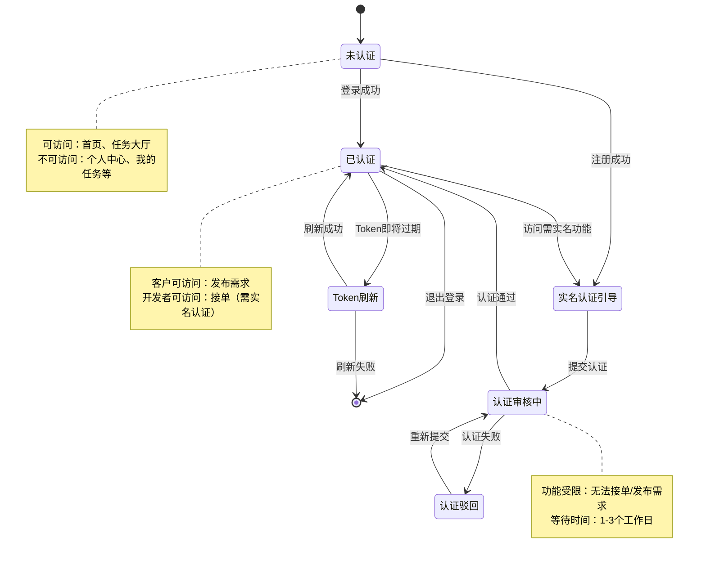

# 用户登录注册系统设计文档（修订版 v2.0）

## 文档修订说明

| 版本 | 日期 | 修订内容 |
|------|------|----------|
| v1.0 | 2026-04-07 | 初版方案 |
| v2.0 | 2026-04-07 | 根据评审意见全面修订：改用手机号+验证码、修复安全模型、补充实名认证、拆分双角色模型、修正文件数量、补充高风险场景测试 |

---

## 一、需求理解

### 1.1 业务背景
TechCraft 是一个悬赏接单托管交付平台，需要为「客户」和「开发者」两类用户提供完整的账户系统。**核心约束**：开发者必须完成实名认证才能接单，客户发布需求也受实名认证约束。

### 1.2 核心需求（修订）

| 功能模块 | 需求描述 | 优先级 |
|----------|----------|--------|
| **注册登录** | 手机号 + 验证码登录（非邮箱/密码） | P0 |
| **实名认证** | 开发者必须实名认证；客户发布需求需实名认证 | P0 |
| **双角色账户** | 客户(Client)和开发者(Developer)两种角色 | P0 |
| **角色锁定** | 注册后角色不可更改（避免数据迁移复杂度） | P0 |
| **4个配套页面** | 个人中心、我的任务、账户设置、消息中心 | P1 |

### 1.3 用户画像（修订）

| 角色 | 需求 | 核心功能 | 实名认证要求 |
|------|------|----------|-------------|
| 客户 | 发布悬赏需求、托管资金、验收交付 | 发布需求、资金托管、查看进度 | **发布需求时必需** |
| 开发者 | 报名承接任务、提交交付、收款 | 浏览任务、报名竞标、管理作品集 | **接单前必需** |

### 1.4 认证流程（修订）

```
注册流程：
手机号输入 → 发送验证码 → 验证码校验 → 设置密码 → 选择角色 → 实名认证引导 → 完成注册

登录流程：
手机号输入 → 发送验证码 → 验证码校验 → 登录成功

实名认证流程（开发者）：
填写真实姓名 → 身份证号 → 人脸识别（跳转第三方）→ 认证结果回调

实名认证流程（客户）：
填写企业名称 → 统一社会信用代码 → 对公账户验证（可选）→ 认证完成
```

---

## 二、技术方案

### 2.1 技术栈决策（重要）

**决策：以当前仓库约束为准，使用原生 HTML/CSS/JS**

| 技术选型 | 当前方案 | 说明 |
|----------|----------|------|
| 前端框架 | 无（原生 JS） | 遵循 CLAUDE.md 约束 |
| 类型系统 | JSDoc 注释 | 提供 TypeScript 风格的类型提示 |
| 构建工具 | 无 | 直接使用源文件 |
| 未来迁移 | React 18 + TypeScript | 作为技术储备，后续迁移目标 |

**原因**：
1. 当前仓库已有大量原生 JS 代码，迁移成本高
2. PRD 的 React 方案作为长期目标，不影响当前 MVP 实现
3. 使用 JSDoc 可以提供类型安全，便于未来迁移

### 2.2 整体架构

```
┌─────────────────────────────────────────────────────────────┐
│                        前端架构（原生 JS）                    │
├─────────────────────────────────────────────────────────────┤
│  页面层        │  login.html, register.html, verify.html    │
│                │  profile.html, my-tasks.html, settings.html │
│                │  messages.html, reset-password.html         │
├─────────────────────────────────────────────────────────────┤
│  交互层        │  login.js, register.js, profile.js          │
│                │  my-tasks.js, settings.js, messages.js      │
├─────────────────────────────────────────────────────────────┤
│  业务逻辑层    │  auth-service.js (认证服务)                  │
│                │  http-client.js (HTTP 请求封装)             │
├─────────────────────────────────────────────────────────────┤
│  状态管理层    │  auth-state.js (认证状态 + 跨标签页同步)     │
│                │  auth-storage.js (存储工具)                 │
├─────────────────────────────────────────────────────────────┤
│  配置层        │  auth-config.js (角色、API、错误码)          │
│                │  verification-code.js (验证码倒计时)         │
├─────────────────────────────────────────────────────────────┤
│  共享组件层    │  form-validator.js (表单验证)               │
│                │  auth-guard.js (认证守卫/路由拦截)          │
│                │  notification.js (统一通知组件)             │
├─────────────────────────────────────────────────────────────┤
│  布局层        │  shared-layout.js (导航栏、页脚)            │
└─────────────────────────────────────────────────────────────┘
                              │
                              ▼
┌─────────────────────────────────────────────────────────────┐
│                    后端 RESTful API                          │
│  POST /api/auth/send-code     POST /api/auth/verify-code    │
│  POST /api/auth/login         POST /api/auth/register       │
│  POST /api/auth/real-name     GET  /api/real-name/status    │
│  PUT  /api/users/password     DELETE /api/users/account     │
│  PUT  /api/messages/read-all  GET  /api/tasks/my            │
└─────────────────────────────────────────────────────────────┘
```

### 2.3 认证流程设计（修订）

#### 登录流程（手机号+验证码）
```
用户输入手机号 → 点击"发送验证码" → API调用 → 60秒倒计时
     ↓
用户输入验证码 → 点击"登录" → API验证 → 获取Token → 存储Token → 更新状态 → 跳转
                                     │
                                     ▼
                            { accessToken,
                              refreshToken,
                              expiresIn,
                              user: { role,
                                      realNameStatus,
                                      ... }
                            }
```

#### 注册流程（4步向导）
```
步骤1: 手机验证 → 步骤2: 设置密码 → 步骤3: 角色选择 → 步骤4: 实名认证引导
(验证码)          (密码+确认)        (客户/开发者)        (跳转认证页面)
```

### 2.4 Token 管理策略（修订 - 统一安全模型）

| Token类型 | 有效期 | 存储位置 | 存储条件 | 用途 |
|-----------|--------|----------|----------|------|
| Access Token | 1小时 | localStorage | rememberMe=true | API请求认证 |
| Access Token | 1小时 | sessionStorage | rememberMe=false | API请求认证 |
| Refresh Token | 7天 | localStorage | rememberMe=true | 刷新访问令牌 |
| Refresh Token | 7天 | sessionStorage | rememberMe=false | 刷新访问令牌 |
| 用户数据 | - | localStorage | 跟随 rememberMe | 用户信息缓存 |

**重要修改**：用户资料存储位置现在跟随 `rememberMe` 参数，避免隐性持久化。

### 2.5 状态管理方案（修订 - 增加跨标签页同步）

```javascript
class AuthStateManager {
    currentUser: null | User
    isAuthenticated: boolean
    listeners: Function[]

    // 事件类型
    EVENTS = {
        LOGIN: 'login',              // 登录成功
        LOGOUT: 'logout',            // 退出登录
        TOKEN_REFRESH: 'refresh',    // Token刷新
        USER_UPDATE: 'update',       // 用户信息更新
        REAL_NAME_STATUS: 'realname' // 实名认证状态变化
    }

    // 跨标签页同步机制
    setupCrossTabSync() {
        window.addEventListener('storage', (e) => {
            if (e.key === 'techcraft_auth_event') {
                const { type, data } = JSON.parse(e.newValue);
                this.handleCrossTabEvent(type, data);
            }
        });
    }
}
```

### 2.6 双角色数据模型（修订 - 完全拆分）

#### 客户数据模型
```javascript
{
    id: "usr_123456",
    phone: "13800138000",
    name: "张三",
    role: "client",
    realNameStatus: "verified",  // pending | verified | rejected
    company: {
        name: "某某科技有限公司",
        creditCode: "91110000XXXXXXXX",
        bankAccount: "6222************1234"
    },
    stats: {
        postedTasks: 5,
        totalBudget: 45000,
        inProgressTasks: 2
    }
}
```

#### 开发者数据模型
```javascript
{
    id: "usr_123456",
    phone: "13800138000",
    name: "李四",
    role: "developer",
    realNameStatus: "verified",
    profile: {
        realName: "李四",
        idCard: "110***********1234",
        skills: ["React", "Node.js"],
        experience: "3-5年",
        portfolioUrl: "https://...",
        bio: "全栈开发工程师"
    },
    stats: {
        completedTasks: 15,
        totalEarnings: 45000,
        rating: 4.8
    }
}
```

### 2.7 实名认证状态机（新增）

```
┌─────────────┐
│  NOT_STARTED │  未开始认证
└──────┬──────┘
       │ 提交认证信息
       ▼
┌─────────────┐
│  PENDING     │  待审核
└──────┬──────┘
       │
       ▼
┌─────────────┐      ┌─────────────┐
│  VERIFIED    │      │  REJECTED    │
│  已认证      │      │  已驳回      │
└─────────────┘      └─────────────┘
       │                    │
       │                    │ 重新提交
       ▼                    ▼
    ┌─────────────────────┐
    │   可接单/可发布需求   │
    └─────────────────────┘
```

---

## 三、文件改动清单（修订）

### 3.1 新增文件（25个）

#### HTML 页面（8个）
```
login.html                  # 登录页面（手机号+验证码）
register.html               # 注册页面（4步向导）
verify.html                 # 验证码页面（独立访问）
real-name-auth.html         # 实名认证页面
profile-client.html         # 客户个人中心
profile-developer.html      # 开发者个人中心
my-tasks.html               # 我的任务（双角色）
settings.html               # 账户设置
messages.html               # 消息中心
reset-password.html         # 重置密码页面
```

#### CSS 样式文件（8个）
```
assets/css/auth.css             # 认证页面通用样式
assets/css/login.css            # 登录页面样式
assets/css/register.css         # 注册页面样式
assets/css/profile.css          # 个人中心样式（客户+开发者）
assets/css/my-tasks.css         # 任务管理样式
assets/css/settings.css         # 账户设置样式
assets/css/messages.css         # 消息中心样式
assets/css/real-name-auth.css   # 实名认证样式
```

#### JavaScript 模块（14个）
```
assets/js/auth-config.js           # 认证配置（角色、API、错误码）
assets/js/auth-storage.js          # 存储工具（修订）
assets/js/http-client.js           # HTTP 客户端（重写）
assets/js/auth-service.js          # 认证服务层
assets/js/auth-state.js            # 认证状态管理（跨标签页同步）
assets/js/auth-guard.js            # 认证守卫（路由拦截）
assets/js/verification-code.js     # 验证码倒计时
assets/js/form-validator.js        # 表单验证工具
assets/js/notification.js          # 统一通知组件
assets/js/login.js                 # 登录页面逻辑
assets/js/register.js              # 注册页面逻辑
assets/js/profile-client.js        # 客户个人中心逻辑
assets/js/profile-developer.js     # 开发者个人中心逻辑
assets/js/my-tasks.js              # 任务管理逻辑
assets/js/settings.js              # 账户设置逻辑
assets/js/messages.js              # 消息中心逻辑
assets/js/real-name-auth.js        # 实名认证逻辑
```

### 3.2 修改文件（1个）

```
assets/js/shared-layout.js    # 添加登录状态管理、双角色菜单渲染
```

### 3.3 文件依赖关系（修订）

```
shared-layout.js
    ├── auth-state.js
    │   ├── auth-storage.js
    │   └── auth-config.js
    └── auth-service.js
        └── http-client.js

login.html
    ├── login.js
    │   ├── auth-service.js
    │   ├── verification-code.js
    │   └── form-validator.js
    └── auth.css

register.html
    ├── register.js
    │   ├── auth-service.js
    │   ├── verification-code.js
    │   └── form-validator.js
    └── auth.css

profile-client.html
    ├── profile-client.js
    │   ├── auth-service.js
    │   ├── auth-guard.js
    │   └── notification.js
    └── profile.css

其他页面同理...
```

---

## 四、API 接口设计（修订 - 完整覆盖）

### 4.1 认证接口

#### 发送验证码
```http
POST /api/auth/send-code
Content-Type: application/json

Request:
{
    "phone": "13800138000",
    "type": "login"  // login | register | reset_password
}

Response 200:
{
    "success": true,
    "data": {
        "expiresIn": 300,  // 5分钟有效期
        "message": "验证码已发送"
    }
}

Response 429:
{
    "success": false,
    "error": {
        "code": "SEND_LIMIT_EXCEEDED",
        "message": "发送过于频繁，请60秒后再试"
    }
}
```

#### 验证码登录
```http
POST /api/auth/login
Content-Type: application/json

Request:
{
    "phone": "13800138000",
    "code": "123456",
    "rememberMe": true
}

Response 200:
{
    "success": true,
    "data": {
        "user": {
            "id": "usr_123456",
            "phone": "13800138000",
            "name": "张三",
            "role": "developer",
            "realNameStatus": "verified",
            "avatar": "https://cdn.example.com/avatar.jpg"
        },
        "tokens": {
            "accessToken": "eyJhbGciOiJIUzI1NiIsInR5cCI6IkpXVCJ9...",
            "refreshToken": "eyJhbGciOiJIUzI1NiIsInR5cCI6IkpXVCJ9...",
            "expiresIn": 3600
        }
    }
}

Response 401:
{
    "success": false,
    "error": {
        "code": "INVALID_CODE",
        "message": "验证码错误或已过期"
    }
}
```

#### 用户注册
```http
POST /api/auth/register
Content-Type: application/json

Request:
{
    "phone": "13800138000",
    "code": "123456",
    "password": "Password123!",
    "role": "developer",
    "name": "张三"
}

Response 201:
{
    "success": true,
    "data": {
        "user": {
            "id": "usr_123456",
            "phone": "13800138000",
            "name": "张三",
            "role": "developer",
            "realNameStatus": "not_started"
        },
        "message": "注册成功，请完成实名认证"
    }
}

Response 400:
{
    "success": false,
    "error": {
        "code": "PHONE_EXISTS",
        "message": "该手机号已注册"
    }
}
```

#### 刷新Token
```http
POST /api/auth/refresh-token
Content-Type: application/json

Request:
{
    "refreshToken": "eyJhbGciOiJIUzI1NiIsInR5cCI6IkpXVCJ9..."
}

Response 200:
{
    "success": true,
    "data": {
        "accessToken": "eyJhbGciOiJIUzI1NiIsInR5cCI6IkpXVCJ9...",
        "expiresIn": 3600
    }
}

Response 401:
{
    "success": false,
    "error": {
        "code": "INVALID_REFRESH_TOKEN",
        "message": "刷新令牌无效或已过期"
    }
}
```

#### 退出登录
```http
POST /api/auth/logout
Authorization: Bearer {accessToken}

Response 200:
{
    "success": true,
    "data": {
        "message": "退出成功"
    }
}
```

### 4.2 实名认证接口

#### 提交实名认证（开发者）
```http
POST /api/auth/real-name
Authorization: Bearer {accessToken}
Content-Type: application/json

Request:
{
    "role": "developer",
    "realName": "张三",
    "idCard": "110101199001011234",
    "faceImage": "base64..."  // 人脸识别照片
}

Response 200:
{
    "success": true,
    "data": {
        "status": "pending",
        "message": "实名认证已提交，预计1-3个工作日完成审核"
    }
}

Response 400:
{
    "success": false,
    "error": {
        "code": "ID_CARD_VERIFIED_FAILED",
        "message": "身份证号码验证失败"
    }
}
```

#### 提交企业认证（客户）
```http
POST /api/auth/real-name
Authorization: Bearer {accessToken}
Content-Type: application/json

Request:
{
    "role": "client",
    "companyName": "某某科技有限公司",
    "creditCode": "91110000MA1234567X",
    "bankAccount": "6222020200001234567"
}

Response 200:
{
    "success": true,
    "data": {
        "status": "pending",
        "message": "企业认证已提交"
    }
}
```

#### 获取认证状态
```http
GET /api/auth/real-name/status
Authorization: Bearer {accessToken}

Response 200:
{
    "success": true,
    "data": {
        "status": "verified",  // not_started | pending | verified | rejected
        "realName": "张三",    // 脱敏显示
        "idCard": "110***********1234",
        "rejectedReason": null
    }
}
```

### 4.3 用户接口

#### 获取客户资料
```http
GET /api/users/profile
Authorization: Bearer {accessToken}

Response 200:
{
    "success": true,
    "data": {
        "user": {
            "id": "usr_123456",
            "phone": "138****8000",
            "name": "张三",
            "role": "client",
            "realNameStatus": "verified",
            "company": {
                "name": "某某科技有限公司",
                "creditCode": "91110000MA1234567X"
            },
            "stats": {
                "postedTasks": 5,
                "totalBudget": 45000,
                "inProgressTasks": 2
            }
        }
    }
}
```

#### 获取开发者资料
```http
GET /api/users/profile
Authorization: Bearer {accessToken}

Response 200:
{
    "success": true,
    "data": {
        "user": {
            "id": "usr_123456",
            "phone": "138****8000",
            "name": "张三",
            "role": "developer",
            "realNameStatus": "verified",
            "profile": {
                "realName": "张三",
                "idCard": "110***********1234",
                "skills": ["React", "Node.js", "Python"],
                "experience": "3-5年",
                "portfolioUrl": "https://portfolio.example.com",
                "bio": "全栈开发工程师，专注于Web应用开发",
                "avatar": "https://cdn.example.com/avatar.jpg"
            },
            "stats": {
                "completedTasks": 15,
                "totalEarnings": 45000,
                "rating": 4.8
            }
        }
    }
}
```

#### 更新用户资料
```http
PUT /api/users/profile
Authorization: Bearer {accessToken}
Content-Type: application/json

Request (开发者):
{
    "name": "李四",
    "bio": "新简介",
    "skills": ["React", "Node.js", "Python", "UI/UX"],
    "experience": "5-10年",
    "portfolioUrl": "https://newportfolio.example.com"
}

Request (客户):
{
    "name": "李四",
    "companyName": "新公司名称"
}

Response 200:
{
    "success": true,
    "data": {
        "user": { /* 更新后的用户信息 */ }
    }
}
```

#### 修改密码
```http
PUT /api/users/password
Authorization: Bearer {accessToken}
Content-Type: application/json

Request:
{
    "oldPassword": "OldPassword123!",
    "newPassword": "NewPassword456!"
}

Response 200:
{
    "success": true,
    "data": {
        "message": "密码修改成功"
    }
}

Response 400:
{
    "success": false,
    "error": {
        "code": "INVALID_OLD_PASSWORD",
        "message": "当前密码错误"
    }
}
```

#### 注销账户
```http
DELETE /api/users/account
Authorization: Bearer {accessToken}
Content-Type: application/json

Request:
{
    "reason": "no_longer_use"  // optional
}

Response 200:
{
    "success": true,
    "data": {
        "message": "账户注销申请已提交，30天后生效"
    }
}
```

### 4.4 任务接口（双角色）

#### 获取我的任务（客户视角）
```http
GET /api/tasks/my?role=client&status=all&page=1&limit=10
Authorization: Bearer {accessToken}

Response 200:
{
    "success": true,
    "data": {
        "tasks": [
            {
                "id": "task_123",
                "title": "企业官网开发",
                "status": "recruiting",  // recruiting | in_progress | completed | cancelled
                "budget": { "min": 8000, "max": 12000, "escrowed": 5000 },
                "deadline": "2024-06-01",
                "biddersCount": 5,
                "selectedDeveloper": null,
                "createdAt": "2024-04-01T10:00:00Z"
            }
        ],
        "pagination": {
            "page": 1,
            "limit": 10,
            "total": 25,
            "totalPages": 3
        }
    }
}
```

#### 获取我的任务（开发者视角）
```http
GET /api/tasks/my?role=developer&status=all&page=1&limit=10
Authorization: Bearer {accessToken}

Response 200:
{
    "success": true,
    "data": {
        "tasks": [
            {
                "id": "task_123",
                "title": "企业官网开发",
                "status": "in_progress",
                "bidBudget": 10000,
                "client": { "id": "cli_456", "name": "某某公司" },
                "progress": 60,
                "nextMilestone": "设计稿交付",
                "paymentStatus": "partial",
                "createdAt": "2024-04-01T10:00:00Z"
            }
        ],
        "pagination": {
            "page": 1,
            "limit": 10,
            "total": 15,
            "totalPages": 2
        }
    }
}
```

### 4.5 消息接口

#### 获取消息列表
```http
GET /api/messages?type=all&page=1&limit=20
Authorization: Bearer {accessToken}

Response 200:
{
    "success": true,
    "data": {
        "messages": [
            {
                "id": "msg_123",
                "type": "task",
                "title": "任务状态更新",
                "content": "您承接的任务「企业官网开发」已进入开发阶段",
                "isRead": false,
                "relatedTaskId": "task_123",
                "createdAt": "2024-04-07T10:30:00Z"
            },
            {
                "id": "msg_124",
                "type": "system",
                "title": "实名认证通过",
                "content": "您的实名认证已通过审核",
                "isRead": false,
                "createdAt": "2024-04-07T09:00:00Z"
            }
        ],
        "unreadCount": 5,
        "pagination": {
            "page": 1,
            "limit": 20,
            "total": 50,
            "totalPages": 3
        }
    }
}
```

#### 标记单条消息已读
```http
PUT /api/messages/{id}/read
Authorization: Bearer {accessToken}

Response 200:
{
    "success": true,
    "data": {
        "message": "已标记为已读"
    }
}
```

#### 全部标记为已读
```http
PUT /api/messages/read-all
Authorization: Bearer {accessToken}

Response 200:
{
    "success": true,
    "data": {
        "count": 5,
        "message": "已标记5条消息为已读"
    }
}
```

#### 删除消息
```http
DELETE /api/messages/{id}
Authorization: Bearer {accessToken}

Response 200:
{
    "success": true,
    "data": {
        "message": "消息已删除"
    }
}
```

---

## 五、错误码表（新增）

### 5.1 认证相关错误码

| 错误码 | HTTP状态 | 描述 | 用户提示 |
|--------|----------|------|----------|
| `INVALID_PHONE` | 400 | 手机号格式错误 | 请输入有效的手机号 |
| `PHONE_EXISTS` | 400 | 手机号已注册 | 该手机号已注册，请直接登录 |
| `PHONE_NOT_FOUND` | 404 | 手机号未注册 | 该手机号未注册，请先注册 |
| `INVALID_CODE` | 401 | 验证码错误或已过期 | 验证码错误，请重新获取 |
| `CODE_EXPIRED` | 401 | 验证码已过期 | 验证码已过期，请重新获取 |
| `SEND_LIMIT_EXCEEDED` | 429 | 验证码发送频率超限 | 发送过于频繁，请60秒后再试 |
| `INVALID_REFRESH_TOKEN` | 401 | 刷新令牌无效 | 登录已过期，请重新登录 |
| `SESSION_EXPIRED` | 401 | 会话已过期 | 登录已过期，请重新登录 |

### 5.2 实名认证错误码

| 错误码 | HTTP状态 | 描述 | 用户提示 |
|--------|----------|------|----------|
| `REAL_NAME_VERIFIED` | 400 | 已完成实名认证 | 您已完成实名认证 |
| `REAL_NAME_PENDING` | 400 | 实名认证审核中 | 您的实名认证正在审核中，请耐心等待 |
| `ID_CARD_INVALID` | 400 | 身份证号格式错误 | 请输入正确的身份证号 |
| `ID_CARD_VERIFIED_FAILED` | 400 | 身份证验证失败 | 身份证信息验证失败，请检查后重试 |
| `FACE_VERIFY_FAILED` | 400 | 人脸识别失败 | 人脸识别失败，请重试 |
| `REAL_NAME_REJECTED` | 403 | 实名认证被驳回 | 您的实名认证未通过，原因：{reason} |

### 5.3 用户相关错误码

| 错误码 | HTTP状态 | 描述 | 用户提示 |
|--------|----------|------|----------|
| `USER_NOT_FOUND` | 404 | 用户不存在 | 用户不存在 |
| `INVALID_OLD_PASSWORD` | 400 | 当前密码错误 | 当前密码错误 |
| `PASSWORD_WEAK` | 400 | 密码强度不足 | 密码需包含大小写字母、数字，至少8位 |
| `ACCOUNT_LOCKED` | 403 | 账户已锁定 | 账户已被锁定，请联系客服 |
| `REAL_NAME_REQUIRED` | 403 | 需要实名认证 | 请先完成实名认证 |

### 5.4 权限相关错误码

| 错误码 | HTTP状态 | 描述 | 用户提示 |
|--------|----------|------|----------|
| `PERMISSION_DENIED` | 403 | 权限不足 | 您没有权限执行此操作 |
| `ROLE_LOCKED` | 403 | 角色已锁定 | 注册后角色不可更改 |
| `REQUIRE_REAL_NAME` | 403 | 需要实名认证 | 请先完成实名认证后再操作 |

---

## 六、核心模块设计（修订）

### 6.1 auth-config.js - 认证配置（修订）

```javascript
/**
 * [FILE] auth-config.js - 认证配置文件
 * [POS] 定义认证相关的常量、枚举、API端点、错误码
 * [IN] 无
 * [OUT] 配置对象
 * [DEP] 无
 * [SIDE EFFECT] 无
 * [TEST] 验证配置值正确性
 */

// ============================================
// 用户角色枚举
// ============================================
const USER_ROLES = {
    CLIENT: 'client',
    DEVELOPER: 'developer'
};

// 角色显示名称
const ROLE_LABELS = {
    [USER_ROLES.CLIENT]: '客户',
    [USER_ROLES.DEVELOPER]: '开发者'
};

// ============================================
// 认证状态
// ============================================
const AUTH_STATUS = {
    AUTHENTICATED: 'authenticated',
    UNAUTHENTICATED: 'unauthenticated',
    LOADING: 'loading',
    ERROR: 'error'
};

// ============================================
// 实名认证状态
// ============================================
const REAL_NAME_STATUS = {
    NOT_STARTED: 'not_started',    // 未开始
    PENDING: 'pending',            // 待审核
    VERIFIED: 'verified',          // 已认证
    REJECTED: 'rejected'           // 已驳回
};

// ============================================
// API 端点配置
// ============================================
const API_ENDPOINTS = {
    // 认证
    SEND_CODE: '/api/auth/send-code',
    LOGIN: '/api/auth/login',
    REGISTER: '/api/auth/register',
    REFRESH_TOKEN: '/api/auth/refresh-token',
    LOGOUT: '/api/auth/logout',

    // 实名认证
    SUBMIT_REAL_NAME: '/api/auth/real-name',
    GET_REAL_NAME_STATUS: '/api/auth/real-name/status',

    // 用户
    GET_PROFILE: '/api/users/profile',
    UPDATE_PROFILE: '/api/users/profile',
    CHANGE_PASSWORD: '/api/users/password',
    DELETE_ACCOUNT: '/api/users/account',

    // 任务
    GET_MY_TASKS: '/api/tasks/my',

    // 消息
    GET_MESSAGES: '/api/messages',
    MARK_MESSAGE_READ: '/api/messages/{id}/read',
    MARK_ALL_READ: '/api/messages/read-all',
    DELETE_MESSAGE: '/api/messages/{id}'
};

// ============================================
// Token 配置
// ============================================
const TOKEN_CONFIG = {
    ACCESS_TOKEN_EXPIRY: 3600,      // 1小时（秒）
    REFRESH_TOKEN_EXPIRY: 604800,   // 7天（秒）
    REFRESH_THRESHOLD: 300,         // 提前5分钟刷新
    REFRESH_RETRY_LIMIT: 3          // 刷新重试次数
};

// ============================================
// 验证码配置
// ============================================
const CODE_CONFIG = {
    EXPIRY: 300,                    // 5分钟（秒）
    SEND_INTERVAL: 60,              // 发送间隔（秒）
    MAX_ATTEMPTS: 3                 // 最大尝试次数
};

// ============================================
// 开发者技能标签
// ============================================
const DEVELOPER_SKILLS = [
    'React', 'Vue', 'Angular', 'Node.js', 'Python',
    'Java', 'Go', 'TypeScript', 'UI/UX设计', '产品设计',
    '项目管理', '测试', '运维', '数据库', '小程序'
];

// ============================================
// 工作经验选项
// ============================================
const EXPERIENCE_OPTIONS = [
    { value: '0-1年', label: '1年以下' },
    { value: '1-3年', label: '1-3年' },
    { value: '3-5年', label: '3-5年' },
    { value: '5-10年', label: '5-10年' },
    { value: '10年以上', label: '10年以上' }
];

// ============================================
// 导出
// ============================================
export {
    USER_ROLES,
    ROLE_LABELS,
    AUTH_STATUS,
    REAL_NAME_STATUS,
    API_ENDPOINTS,
    TOKEN_CONFIG,
    CODE_CONFIG,
    DEVELOPER_SKILLS,
    EXPERIENCE_OPTIONS
};
```

### 6.2 auth-storage.js - 存储工具（修订）

```javascript
/**
 * [FILE] auth-storage.js - 认证存储工具（修订版）
 * [POS] 管理认证数据的本地存储，支持跨标签页同步
 * [IN] 用户数据、Token、rememberMe 标志
 * [OUT] 存储的数据
 * [DEP] auth-config.js
 * [SIDE EFFECT] 读写 localStorage/sessionStorage
 * [TEST] 验证存储和读取功能；验证 rememberMe 逻辑
 */

import { TOKEN_CONFIG } from './auth-config.js';

// ============================================
// 存储键
// ============================================
const STORAGE_KEYS = {
    ACCESS_TOKEN: 'techcraft_access_token',
    REFRESH_TOKEN: 'techcraft_refresh_token',
    USER_DATA: 'techcraft_user_data',
    TOKEN_EXPIRY: 'techcraft_token_expiry',
    AUTH_EVENT: 'techcraft_auth_event'  // 跨标签页同步事件
};

// ============================================
// 存储工具类
// ============================================
class AuthStorage {
    /**
     * 获取存储对象（根据 rememberMe 选择存储方式）
     * @param {boolean} rememberMe - 是否记住我
     * @returns {Storage} localStorage 或 sessionStorage
     */
    static getStorage(rememberMe = false) {
        return rememberMe ? localStorage : sessionStorage;
    }

    /**
     * 获取当前使用的存储（自动检测）
     * @returns {Storage} localStorage 或 sessionStorage
     */
    static getCurrentStorage() {
        // 优先检查 sessionStorage
        if (sessionStorage.getItem(STORAGE_KEYS.ACCESS_TOKEN)) {
            return sessionStorage;
        }
        // 其次检查 localStorage
        if (localStorage.getItem(STORAGE_KEYS.ACCESS_TOKEN)) {
            return localStorage;
        }
        // 默认返回 sessionStorage
        return sessionStorage;
    }

    /**
     * 保存 Token
     * @param {string} accessToken - 访问令牌
     * @param {string} refreshToken - 刷新令牌
     * @param {boolean} rememberMe - 是否记住我
     */
    static saveTokens(accessToken, refreshToken, rememberMe = false) {
        const storage = this.getStorage(rememberMe);

        storage.setItem(STORAGE_KEYS.ACCESS_TOKEN, accessToken);
        storage.setItem(STORAGE_KEYS.REFRESH_TOKEN, refreshToken);

        const expiry = Date.now() + (TOKEN_CONFIG.ACCESS_TOKEN_EXPIRY * 1000);
        storage.setItem(STORAGE_KEYS.TOKEN_EXPIRY, expiry.toString());

        // 清除另一个存储中的 Token（避免冲突）
        const otherStorage = rememberMe ? sessionStorage : localStorage;
        otherStorage.removeItem(STORAGE_KEYS.ACCESS_TOKEN);
        otherStorage.removeItem(STORAGE_KEYS.REFRESH_TOKEN);
        otherStorage.removeItem(STORAGE_KEYS.TOKEN_EXPIRY);
    }

    /**
     * 获取访问令牌
     * @returns {string|null}
     */
    static getAccessToken() {
        return this.getCurrentStorage().getItem(STORAGE_KEYS.ACCESS_TOKEN);
    }

    /**
     * 获取刷新令牌
     * @returns {string|null}
     */
    static getRefreshToken() {
        return this.getCurrentStorage().getItem(STORAGE_KEYS.REFRESH_TOKEN);
    }

    /**
     * 检查 Token 是否即将过期
     * @returns {boolean}
     */
    static isTokenExpiringSoon() {
        const expiry = this.getCurrentStorage().getItem(STORAGE_KEYS.TOKEN_EXPIRY);
        if (!expiry) return true;

        const expiryTime = parseInt(expiry);
        const now = Date.now();
        const threshold = TOKEN_CONFIG.REFRESH_THRESHOLD * 1000;

        return expiryTime - now < threshold;
    }

    /**
     * 保存用户数据（修订：跟随 rememberMe）
     * @param {Object} userData - 用户数据
     * @param {boolean} rememberMe - 是否记住我
     */
    static saveUserData(userData, rememberMe = false) {
        const storage = this.getStorage(rememberMe);
        storage.setItem(STORAGE_KEYS.USER_DATA, JSON.stringify(userData));

        // 清除另一个存储中的用户数据
        const otherStorage = rememberMe ? sessionStorage : localStorage;
        otherStorage.removeItem(STORAGE_KEYS.USER_DATA);
    }

    /**
     * 获取用户数据
     * @returns {Object|null}
     */
    static getUserData() {
        // 从当前存储获取
        let data = this.getCurrentStorage().getItem(STORAGE_KEYS.USER_DATA);
        if (data) {
            return JSON.parse(data);
        }

        // 兼容：如果当前存储没有，尝试从 localStorage 获取
        data = localStorage.getItem(STORAGE_KEYS.USER_DATA);
        if (data) {
            return JSON.parse(data);
        }

        return null;
    }

    /**
     * 检查是否已认证
     * @returns {boolean}
     */
    static isAuthenticated() {
        const token = this.getAccessToken();
        const expiry = this.getCurrentStorage().getItem(STORAGE_KEYS.TOKEN_EXPIRY);

        if (!token || !expiry) {
            return false;
        }

        return Date.now() < parseInt(expiry);
    }

    /**
     * 清除认证数据（所有存储）
     */
    static clearAuthData() {
        // 清除 localStorage
        localStorage.removeItem(STORAGE_KEYS.ACCESS_TOKEN);
        localStorage.removeItem(STORAGE_KEYS.REFRESH_TOKEN);
        localStorage.removeItem(STORAGE_KEYS.USER_DATA);
        localStorage.removeItem(STORAGE_KEYS.TOKEN_EXPIRY);
        localStorage.removeItem(STORAGE_KEYS.AUTH_EVENT);

        // 清除 sessionStorage
        sessionStorage.removeItem(STORAGE_KEYS.ACCESS_TOKEN);
        sessionStorage.removeItem(STORAGE_KEYS.REFRESH_TOKEN);
        sessionStorage.removeItem(STORAGE_KEYS.USER_DATA);
        sessionStorage.removeItem(STORAGE_KEYS.TOKEN_EXPIRY);
        sessionStorage.removeItem(STORAGE_KEYS.AUTH_EVENT);
    }

    /**
     * 广播认证事件（跨标签页同步）
     * @param {string} type - 事件类型
     * @param {Object} data - 事件数据
     */
    static broadcastAuthEvent(type, data) {
        const event = {
            type,
            data,
            timestamp: Date.now()
        };

        // 同时写入 localStorage 和 sessionStorage
        localStorage.setItem(STORAGE_KEYS.AUTH_EVENT, JSON.stringify(event));
        sessionStorage.setItem(STORAGE_KEYS.AUTH_EVENT, JSON.stringify(event));
    }

    /**
     * 清除认证事件
     */
    static clearAuthEvent() {
        localStorage.removeItem(STORAGE_KEYS.AUTH_EVENT);
        sessionStorage.removeItem(STORAGE_KEYS.AUTH_EVENT);
    }
}

export default AuthStorage;
```

### 6.3 http-client.js - HTTP 客户端（重写）

```javascript
/**
 * [FILE] http-client.js - HTTP 请求客户端（修订版）
 * [POS] 封装 fetch API，添加认证拦截器和自动刷新 Token
 * [IN] URL、选项
 * [OUT] 响应数据
 * [DEP] auth-storage.js, auth-config.js
 * [SIDE EFFECT] 发送网络请求
 * [TEST] 验证请求拦截、响应处理、Token 自动刷新
 */

import AuthStorage from './auth-storage.js';
import authState from './auth-state.js';
import { API_ENDPOINTS, TOKEN_CONFIG } from './auth-config.js';

// ============================================
// HTTP 客户端类
// ============================================
class HttpClient {
    constructor() {
        this.baseURL = ''; // 后端 API 基础 URL
        this.isRefreshing = false;
        this.refreshQueue = [];
        this.refreshRetryCount = 0;
    }

    /**
     * 发送 HTTP 请求
     * @param {string} url - 请求 URL
     * @param {Object} options - 请求选项
     * @returns {Promise<Object>} 响应数据
     */
    async fetch(url, options = {}) {
        // 构建请求配置
        const config = this.buildRequestConfig(options);

        try {
            let response = await fetch(this.baseURL + url, config);

            // 处理 401 未授权响应
            if (response.status === 401 && !options.skipAuthRefresh) {
                return await this.handle401Response(url, config);
            }

            // 处理其他错误响应
            if (!response.ok) {
                return await this.handleErrorResponse(response);
            }

            // 解析成功响应
            return await response.json();

        } catch (error) {
            // 网络错误处理
            console.error('HTTP Request Error:', error);
            throw {
                success: false,
                error: {
                    code: 'NETWORK_ERROR',
                    message: '网络连接失败，请检查网络设置'
                }
            };
        }
    }

    /**
     * 构建请求配置
     * @param {Object} options - 原始选项
     * @returns {Object} 请求配置
     */
    buildRequestConfig(options) {
        const config = {
            ...options,
            headers: {
                'Content-Type': 'application/json',
                ...options.headers
            }
        };

        // 自动添加 Authorization 头
        const token = AuthStorage.getAccessToken();
        if (token) {
            config.headers['Authorization'] = `Bearer ${token}`;
        }

        return config;
    }

    /**
     * 处理 401 未授权响应
     * @param {string} url - 原始请求 URL
     * @param {Object} originalConfig - 原始请求配置
     * @returns {Promise<Object>} 响应数据
     */
    async handle401Response(url, originalConfig) {
        // 如果正在刷新 Token，将请求加入队列
        if (this.isRefreshing) {
            return new Promise((resolve, reject) => {
                this.refreshQueue.push({ resolve, reject, url, config: originalConfig });
            });
        }

        // 开始刷新 Token
        this.isRefreshing = true;

        try {
            const newToken = await this.refreshAccessToken();

            // 刷新成功，重试队列中的请求
            this.refreshQueue.forEach(({ resolve, url, config }) => {
                // 更新请求头中的 Token
                config.headers['Authorization'] = `Bearer ${newToken}`;
                resolve(this.fetch(url, { ...config, skipAuthRefresh: true }));
            });

            this.refreshQueue = [];
            this.refreshRetryCount = 0;

            // 重试原始请求
            return this.fetch(url, { ...originalConfig, skipAuthRefresh: true });

        } catch (error) {
            // 刷新失败，拒绝队列中的请求
            this.refreshQueue.forEach(({ reject }) => reject(error));
            this.refreshQueue = [];

            // 刷新失败，执行退出登录
            await authState.onLogout();

            throw {
                success: false,
                error: {
                    code: 'REFRESH_TOKEN_FAILED',
                    message: '登录已过期，请重新登录'
                }
            };

        } finally {
            this.isRefreshing = false;
        }
    }

    /**
     * 刷新访问令牌
     * @returns {Promise<string>} 新的访问令牌
     */
    async refreshAccessToken() {
        const refreshToken = AuthStorage.getRefreshToken();

        if (!refreshToken) {
            throw new Error('No refresh token available');
        }

        // 检查重试次数
        if (this.refreshRetryCount >= TOKEN_CONFIG.REFRESH_RETRY_LIMIT) {
            throw new Error('Refresh token retry limit exceeded');
        }

        this.refreshRetryCount++;

        const response = await fetch(this.baseURL + API_ENDPOINTS.REFRESH_TOKEN, {
            method: 'POST',
            headers: { 'Content-Type': 'application/json' },
            body: JSON.stringify({ refreshToken })
        });

        if (!response.ok) {
            const error = await response.json();
            throw new Error(error.error?.code || 'REFRESH_FAILED');
        }

        const data = await response.json();
        const { accessToken } = data.data;

        // 保存新 Token
        const rememberMe = !!localStorage.getItem(AuthStorage.constructor.name);
        // 获取当前的 rememberMe 状态
        const currentStorage = AuthStorage.getCurrentStorage();
        const isLocalStorage = currentStorage === localStorage;

        AuthStorage.saveTokens(accessToken, refreshToken, isLocalStorage);

        return accessToken;
    }

    /**
     * 处理错误响应
     * @param {Response} response - 响应对象
     * @returns {Promise<never>}
     */
    async handleErrorResponse(response) {
        let errorData;

        try {
            errorData = await response.json();
        } catch {
            errorData = {
                error: {
                    code: 'UNKNOWN_ERROR',
                    message: '请求失败，请稍后重试'
                }
            };
        }

        throw errorData;
    }

    /**
     * GET 请求
     * @param {string} url - 请求 URL
     * @param {Object} options - 请求选项
     * @returns {Promise<Object>} 响应数据
     */
    get(url, options = {}) {
        return this.fetch(url, { ...options, method: 'GET' });
    }

    /**
     * POST 请求
     * @param {string} url - 请求 URL
     * @param {Object} data - 请求数据
     * @param {Object} options - 请求选项
     * @returns {Promise<Object>} 响应数据
     */
    post(url, data, options = {}) {
        return this.fetch(url, {
            ...options,
            method: 'POST',
            body: JSON.stringify(data)
        });
    }

    /**
     * PUT 请求
     * @param {string} url - 请求 URL
     * @param {Object} data - 请求数据
     * @param {Object} options - 请求选项
     * @returns {Promise<Object>} 响应数据
     */
    put(url, data, options = {}) {
        return this.fetch(url, {
            ...options,
            method: 'PUT',
            body: JSON.stringify(data)
        });
    }

    /**
     * DELETE 请求
     * @param {string} url - 请求 URL
     * @param {Object} options - 请求选项
     * @returns {Promise<Object>} 响应数据
     */
    delete(url, options = {}) {
        return this.fetch(url, { ...options, method: 'DELETE' });
    }
}

// ============================================
// 单例导出
// ============================================
const httpClient = new HttpClient();
export default httpClient;
```

### 6.4 auth-state.js - 状态管理（修订 - 增加跨标签页同步）

```javascript
/**
 * [FILE] auth-state.js - 认证状态管理（修订版）
 * [POS] 管理全局认证状态，通知订阅者，支持跨标签页同步
 * [IN] 用户数据、Token
 * [OUT] 状态更新事件
 * [DEP] auth-storage.js, auth-service.js
 * [SIDE EFFECT] 触发状态变化事件，写入 storage 事件
 * [TEST] 验证状态变化、事件通知、跨标签页同步
 */

import AuthStorage from './auth-storage.js';
import authService from './auth-service.js';

// ============================================
// 认证状态管理器
// ============================================
class AuthStateManager {
    constructor() {
        this.currentUser = null;
        this.isAuthenticated = false;
        this.listeners = [];

        // 事件类型
        this.EVENTS = {
            LOGIN: 'login',
            LOGOUT: 'logout',
            TOKEN_REFRESH: 'refresh',
            USER_UPDATE: 'update',
            REAL_NAME_STATUS: 'realname'
        };

        // 初始化
        this.init();
        this.setupCrossTabSync();
    }

    /**
     * 初始化：从存储恢复状态
     */
    init() {
        if (AuthStorage.isAuthenticated()) {
            const userData = AuthStorage.getUserData();
            if (userData) {
                this.currentUser = userData;
                this.isAuthenticated = true;
            }
        }
    }

    /**
     * 设置跨标签页同步
     */
    setupCrossTabSync() {
        window.addEventListener('storage', (e) => {
            if (e.key === 'techcraft_auth_event' && e.newValue) {
                try {
                    const { type, data } = JSON.parse(e.newValue);
                    this.handleCrossTabEvent(type, data);
                } catch (error) {
                    console.error('Cross-tab sync error:', error);
                }
            }
        });
    }

    /**
     * 处理跨标签页事件
     * @param {string} type - 事件类型
     * @param {Object} data - 事件数据
     */
    handleCrossTabEvent(type, data) {
        switch (type) {
            case this.EVENTS.LOGOUT:
                // 其他标签页退出登录，当前标签页同步退出
                this.currentUser = null;
                this.isAuthenticated = false;
                this.notifyListeners(this.EVENTS.LOGOUT);
                // 刷新页面或跳转首页
                if (window.location.pathname !== '/index.html' && window.location.pathname !== '/') {
                    window.location.href = '/index.html';
                }
                break;

            case this.EVENTS.USER_UPDATE:
                // 其他标签页更新了用户信息
                this.currentUser = data;
                AuthStorage.saveUserData(data, AuthStorage.getCurrentStorage() === localStorage);
                this.notifyListeners(this.EVENTS.USER_UPDATE, data);
                break;

            case this.EVENTS.REAL_NAME_STATUS:
                // 实名认证状态变化
                if (this.currentUser) {
                    this.currentUser.realNameStatus = data.status;
                    this.notifyListeners(this.EVENTS.REAL_NAME_STATUS, data);
                }
                break;
        }
    }

    /**
     * 订阅状态变化
     * @param {Function} callback - 回调函数
     * @returns {Function} 取消订阅函数
     */
    subscribe(callback) {
        this.listeners.push(callback);

        // 返回取消订阅函数
        return () => {
            this.listeners = this.listeners.filter(fn => fn !== callback);
        };
    }

    /**
     * 通知所有订阅者
     * @param {string} event - 事件类型
     * @param {Object} data - 事件数据
     */
    notifyListeners(event, data = null) {
        this.listeners.forEach(callback => {
            try {
                callback(event, data);
            } catch (error) {
                console.error('Listener error:', error);
            }
        });
    }

    /**
     * 登录成功处理
     * @param {string} phone - 手机号
     * @param {string} code - 验证码
     * @param {boolean} rememberMe - 是否记住我
     * @returns {Promise<Object>} 登录结果
     */
    async onLoginSuccess(phone, code, rememberMe = false) {
        try {
            const response = await authService.login(phone, code, rememberMe);
            const { user, tokens } = response.data;

            // 保存 Token 和用户数据
            AuthStorage.saveTokens(
                tokens.accessToken,
                tokens.refreshToken,
                rememberMe
            );
            AuthStorage.saveUserData(user, rememberMe);

            // 更新状态
            this.currentUser = user;
            this.isAuthenticated = true;

            // 广播登录事件（跨标签页同步）
            AuthStorage.broadcastAuthEvent(this.EVENTS.LOGIN, user);

            // 通知订阅者
            this.notifyListeners(this.EVENTS.LOGIN, user);

            return { success: true, user };
        } catch (error) {
            console.error('Login error:', error);
            return { success: false, error: error.error?.message || '登录失败' };
        }
    }

    /**
     * 注册成功处理
     * @param {Object} userData - 注册数据
     * @returns {Promise<Object>} 注册结果
     */
    async onRegister(userData) {
        try {
            const response = await authService.register(userData);
            return { success: true, data: response.data };
        } catch (error) {
            console.error('Register error:', error);
            return { success: false, error: error.error?.message || '注册失败' };
        }
    }

    /**
     * 退出登录
     */
    async onLogout() {
        try {
            await authService.logout();
        } catch (error) {
            console.error('Logout API error:', error);
        } finally {
            // 清除本地数据
            AuthStorage.clearAuthData();
            this.currentUser = null;
            this.isAuthenticated = false;

            // 广播退出事件（跨标签页同步）
            AuthStorage.broadcastAuthEvent(this.EVENTS.LOGOUT);

            // 通知订阅者
            this.notifyListeners(this.EVENTS.LOGOUT);
        }
    }

    /**
     * 更新用户信息
     * @param {Object} updates - 更新数据
     * @returns {Promise<Object>} 更新结果
     */
    async onUpdateUser(updates) {
        try {
            const updatedUser = await authService.updateProfile(updates);
            this.currentUser = { ...this.currentUser, ...updatedUser };

            const rememberMe = AuthStorage.getCurrentStorage() === localStorage;
            AuthStorage.saveUserData(this.currentUser, rememberMe);

            // 广播更新事件（跨标签页同步）
            AuthStorage.broadcastAuthEvent(this.EVENTS.USER_UPDATE, this.currentUser);

            // 通知订阅者
            this.notifyListeners(this.EVENTS.USER_UPDATE, this.currentUser);

            return { success: true, user: this.currentUser };
        } catch (error) {
            console.error('Update user error:', error);
            return { success: false, error: error.error?.message || '更新失败' };
        }
    }

    /**
     * 刷新用户数据
     * @returns {Promise<Object|null>} 用户数据
     */
    async refreshUserData() {
        try {
            const user = await authService.getProfile();
            this.currentUser = user;

            const rememberMe = AuthStorage.getCurrentStorage() === localStorage;
            AuthStorage.saveUserData(user, rememberMe);

            this.notifyListeners(this.EVENTS.USER_UPDATE, user);
            return user;
        } catch (error) {
            console.error('Refresh user data error:', error);
            // 刷新失败，可能 token 过期，执行退出
            await this.onLogout();
            return null;
        }
    }

    /**
     * 更新实名认证状态
     * @param {Object} statusData - 状态数据
     */
    updateRealNameStatus(statusData) {
        if (this.currentUser) {
            this.currentUser.realNameStatus = statusData.status;
            this.currentUser.realNameData = statusData;

            // 广播状态变化（跨标签页同步）
            AuthStorage.broadcastAuthEvent(this.EVENTS.REAL_NAME_STATUS, statusData);

            // 通知订阅者
            this.notifyListeners(this.EVENTS.REAL_NAME_STATUS, statusData);
        }
    }

    /**
     * 检查用户权限
     * @param {string} requiredRole - 需要的角色
     * @param {string} requiredStatus - 需要的实名认证状态
     * @returns {Object} 权限检查结果
     */
    checkPermission(requiredRole = null, requiredStatus = null) {
        if (!this.isAuthenticated) {
            return {
                allowed: false,
                reason: 'NOT_AUTHENTICATED',
                message: '请先登录'
            };
        }

        if (requiredRole && this.currentUser.role !== requiredRole) {
            return {
                allowed: false,
                reason: 'ROLE_MISMATCH',
                message: '您没有权限执行此操作'
            };
        }

        if (requiredStatus) {
            const status = this.currentUser.realNameStatus || 'not_started';
            const statusPriority = ['verified', 'pending', 'rejected', 'not_started'];
            const requiredPriority = statusPriority.indexOf(requiredStatus);
            const currentPriority = statusPriority.indexOf(status);

            if (currentPriority < requiredPriority) {
                return {
                    allowed: false,
                    reason: 'REAL_NAME_REQUIRED',
                    message: '请先完成实名认证'
                };
            }
        }

        return { allowed: true };
    }
}

// ============================================
// 单例导出
// ============================================
const authState = new AuthStateManager();
export default authState;
```

### 6.5 verification-code.js - 验证码倒计时（新增）

```javascript
/**
 * [FILE] verification-code.js - 验证码倒计时工具
 * [POS] 管理验证码发送倒计时和防重复提交
 * [IN] 手机号、验证类型
 * [OUT] 倒计时状态、发送结果
 * [DEP] auth-service.js, auth-config.js
 * [SIDE EFFECT] 启动定时器、调用 API
 * [TEST] 验证倒计时逻辑、防重复提交
 */

import authService from './auth-service.js';
import { CODE_CONFIG } from './auth-config.js';

// ============================================
// 验证码管理器
// ============================================
class VerificationCodeManager {
    constructor() {
        this.countdown = 0;
        this.timer = null;
        this.lastSendTime = 0;
        this.currentPhone = '';
    }

    /**
     * 发送验证码
     * @param {string} phone - 手机号
     * @param {string} type - 验证码类型
     * @param {Function} onSuccess - 成功回调
     * @param {Function} onError - 失败回调
     */
    async sendCode(phone, type, onSuccess, onError) {
        // 检查是否在倒计时中
        if (this.countdown > 0) {
            if (onError) {
                onError({ message: `请等待 ${this.countdown} 秒后再试` });
            }
            return;
        }

        // 检查发送间隔
        const now = Date.now();
        if (now - this.lastSendTime < CODE_CONFIG.SEND_INTERVAL * 1000) {
            const waitTime = Math.ceil((CODE_CONFIG.SEND_INTERVAL * 1000 - (now - this.lastSendTime)) / 1000);
            if (onError) {
                onError({ message: `发送过于频繁，请 ${waitTime} 秒后再试` });
            }
            return;
        }

        try {
            const response = await authService.sendCode(phone, type);

            if (response.success) {
                this.currentPhone = phone;
                this.lastSendTime = now;
                this.startCountdown();

                if (onSuccess) {
                    onSuccess(response.data);
                }
            }
        } catch (error) {
            if (onError) {
                onError(error.error || { message: '发送失败' });
            }
        }
    }

    /**
     * 启动倒计时
     */
    startCountdown() {
        this.countdown = CODE_CONFIG.SEND_INTERVAL;

        this.timer = setInterval(() => {
            this.countdown--;

            if (this.countdown <= 0) {
                this.stopCountdown();
            }

            // 触发倒计时更新事件
            this.onCountdownUpdate(this.countdown);
        }, 1000);
    }

    /**
     * 停止倒计时
     */
    stopCountdown() {
        if (this.timer) {
            clearInterval(this.timer);
            this.timer = null;
        }
        this.countdown = 0;
    }

    /**
     * 倒计时更新回调（可被覆盖）
     * @param {number} remaining - 剩余秒数
     */
    onCountdownUpdate(remaining) {
        // 默认空实现，可被外部覆盖
    }

    /**
     * 重置状态
     */
    reset() {
        this.stopCountdown();
        this.lastSendTime = 0;
        this.currentPhone = '';
    }

    /**
     * 获取当前状态
     * @returns {Object} 状态对象
     */
    getState() {
        return {
            countdown: this.countdown,
            isSending: this.countdown > 0,
            currentPhone: this.currentPhone
        };
    }
}

// ============================================
// 单例导出
// ============================================
const verificationCode = new VerificationCodeManager();
export default verificationCode;
```

### 6.6 auth-guard.js - 认证守卫（新增）

```javascript
/**
 * [FILE] auth-guard.js - 认证守卫（路由拦截）
 * [POS] 拦截未认证用户访问受保护页面
 * [IN] 当前路由
 * [OUT] 是否允许访问
 * [DEP] auth-state.js
 * [SIDE EFFECT] 重定向到登录页
 * [TEST] 验证各种拦截场景
 */

import authState from './auth-state.js';

// ============================================
// 受保护的路由配置
// ============================================
const PROTECTED_ROUTES = {
    'profile-client.html': {
        authenticated: true,
        role: 'client',
        realNameStatus: null
    },
    'profile-developer.html': {
        authenticated: true,
        role: 'developer',
        realNameStatus: null
    },
    'my-tasks.html': {
        authenticated: true,
        role: null,  // 两种角色都可以访问
        realNameStatus: null
    },
    'settings.html': {
        authenticated: true,
        role: null,
        realNameStatus: null
    },
    'messages.html': {
        authenticated: true,
        role: null,
        realNameStatus: null
    },
    'real-name-auth.html': {
        authenticated: true,
        role: null,
        realNameStatus: null
    },
    'post-task.html': {
        authenticated: true,
        role: 'client',
        realNameStatus: 'verified'  // 客户发布需求需要实名认证
    },
    'bid-task.html': {
        authenticated: true,
        role: 'developer',
        realNameStatus: 'verified'  // 开发者竞标需要实名认证
    }
};

// ============================================
// 认证守卫类
// ============================================
class AuthGuard {
    /**
     * 检查路由访问权限
     * @param {string} path - 当前路径
     * @returns {Object} 权限检查结果
     */
    checkRoute(path) {
        // 提取文件名
        const filename = path.split('/').pop() || 'index.html';

        // 检查是否是受保护路由
        const routeConfig = PROTECTED_ROUTES[filename];

        if (!routeConfig) {
            return { allowed: true };
        }

        // 检查是否已认证
        if (routeConfig.authenticated && !authState.isAuthenticated) {
            return {
                allowed: false,
                reason: 'NOT_AUTHENTICATED',
                message: '请先登录',
                redirect: 'login.html',
                redirectParams: { returnTo: filename }
            };
        }

        // 检查角色
        if (routeConfig.role && authState.currentUser?.role !== routeConfig.role) {
            return {
                allowed: false,
                reason: 'ROLE_MISMATCH',
                message: '您没有权限访问此页面',
                redirect: 'index.html'
            };
        }

        // 检查实名认证状态
        if (routeConfig.realNameStatus) {
            const currentStatus = authState.currentUser?.realNameStatus || 'not_started';
            if (currentStatus !== routeConfig.realNameStatus) {
                return {
                    allowed: false,
                    reason: 'REAL_NAME_REQUIRED',
                    message: '请先完成实名认证',
                    redirect: 'real-name-auth.html'
                };
            }
        }

        return { allowed: true };
    }

    /**
     * 守卫初始化（在页面加载时调用）
     */
    init() {
        const checkResult = this.checkRoute(window.location.pathname);

        if (!checkResult.allowed) {
            // 构建重定向 URL
            let redirectUrl = checkResult.redirect;
            if (checkResult.redirectParams) {
                const params = new URLSearchParams(checkResult.redirectParams);
                redirectUrl += '?' + params.toString();
            }

            // 保存当前路径
            sessionStorage.setItem('auth_return_to', window.location.pathname);

            // 重定向
            window.location.href = redirectUrl;
            return false;
        }

        return true;
    }

    /**
     * 获取登录后返回路径
     * @returns {string|null} 返回路径
     */
    getReturnPath() {
        const returnTo = sessionStorage.getItem('auth_return_to');
        sessionStorage.removeItem('auth_return_to');
        return returnTo;
    }
}

// ============================================
// 单例导出
// ============================================
const authGuard = new AuthGuard();
export default authGuard;
```

---

## 七、页面设计详细说明（修订 - 区分双角色）

### 7.1 登录页面 (login.html) - 修订为手机号+验证码

```
┌────────────────────────────────────┐
│          TechCraft Logo            │
│        欢迎回来，请登录            │
├────────────────────────────────────┤
│                                    │
│  手机号                            │
│  [+86] [___________________]       │
│                                    │
│  验证码                            │
│  [___________] [发送验证码 60s]    │
│                                    │
│  ☐ 记住我                          │
│                                    │
│  [      登录按钮      ]            │
│                                    │
│  还没有账号？[立即注册]            │
└────────────────────────────────────┘
```

### 7.2 注册页面 (register.html) - 修订为4步向导

#### 步骤1: 手机验证
```
┌────────────────────────────────────┐
│  ●━━━○━━○━━○   步骤 1/4          │
│  验证手机号                        │
├────────────────────────────────────┤
│  手机号                            │
│  [+86] [___________________]       │
│                                    │
│  验证码                            │
│  [___________] [发送验证码]        │
│                                    │
│        [下一步→]                   │
└────────────────────────────────────┘
```

#### 步骤2: 设置密码
```
┌────────────────────────────────────┐
│  ●━━━●━━○━━○   步骤 2/4          │
│  设置登录密码                      │
├────────────────────────────────────┤
│  设置密码                          │
│  [________________________] 👁    │
│  密码强度: ████░ 80% (强)         │
│                                    │
│  确认密码                          │
│  [________________________]        │
│                                    │
│        [←上一步]    [下一步→]       │
└────────────────────────────────────┘
```

#### 步骤3: 角色选择
```
┌────────────────────────────────────┐
│  ●━━━●━━●━━○   步骤 3/4          │
│  选择您的角色（注册后不可更改）    │
├────────────────────────────────────┤
│  ┌────────────────┐  ┌───────────┐│
│  │   👤 客户      │  │  👨‍💻 开发  ││
│  │                │  │   者      ││
│  │  发布悬赏需求  │  │  承接任务  ││
│  │  托管项目资金  │  │  展示技能  ││
│  │  验收交付成果  │  │  提交作品  ││
│  └────────────────┘  └───────────┘│
│                                    │
│  ⚠️ 角色选择后不可更改，请谨慎选择  │
│        [←上一步]    [下一步→]       │
└────────────────────────────────────┘
```

#### 步骤4: 基本信息
```
┌────────────────────────────────────┐
│  ●━━━●━━●━━●   步骤 4/4          │
│  完善基本信息                      │
├────────────────────────────────────┤
│  您的姓名 *                        │
│  [________________________]        │
│                                    │
│  ☐ 我已阅读并同意《用户协议》      │
│  ☐ 我已阅读并同意《隐私政策》      │
│                                    │
│  [    确认注册    ]                │
│                                    │
│        [←上一步]                   │
└────────────────────────────────────┘
```

### 7.3 实名认证页面 (real-name-auth.html) - 新增

#### 开发者实名认证
```
┌──────────────────────────────────────────────┐
│  实名认证                    开发者          │
├──────────────────────────────────────────────┤
│  📋 认证须知                                │
│  · 根据法律法规要求，接单需完成实名认证     │
│  · 认证信息仅用于身份验证，严格保密         │
│  · 审核时间：1-3个工作日                    │
├──────────────────────────────────────────────┤
│  真实姓名 *                                │
│  [________________________]                │
│                                            │
│  身份证号 *                                │
│  [________________________]                │
│                                            │
│  人脸识别 *                                │
│  ┌────────────────┐   [开始人脸识别]      │
│  │                │                      │
│  │   [示例照片]    │   → 跳转第三方认证   │
│  │                │                      │
│  └────────────────┘                      │
│                                            │
│  ☐ 我已阅读并同意《实名认证服务协议》     │
│                                            │
│  [      提交认证      ]                    │
└──────────────────────────────────────────────┘
```

#### 客户企业认证
```
┌──────────────────────────────────────────────┐
│  企业认证                    客户            │
├──────────────────────────────────────────────┤
│  📋 认证须知                                │
│  · 发布需求需完成企业认证                   │
│  · 请确保填写信息真实有效                   │
│  · 审核时间：1-3个工作日                    │
├──────────────────────────────────────────────┤
│  企业名称 *                                │
│  [________________________________]        │
│                                            │
│  统一社会信用代码 *                        │
│  [________________________]                │
│                                            │
│  对公账户（可选）                          │
│  [________________________]                │
│                                            │
│  ☐ 我已阅读并同意《企业认证服务协议》     │
│                                            │
│  [      提交认证      ]                    │
└──────────────────────────────────────────────┘
```

### 7.4 客户个人中心 (profile-client.html) - 新增

```
┌──────────────────────────────────────────────┐
│  个人中心                    [编辑资料]      │
├──────────────────────────────────────────────┤
│  ┌────────┐                                  │
│  │  头像  │  张三                           │
│  │        │  @zhangsan                      │
│  └────────┘  某某科技有限公司               │
│              [客户] [✓已认证]               │
├──────────────────────────────────────────────┤
│  📊 数据统计                                 │
│  ┌────────┐ ┌────────┐ ┌────────┐          │
│  │   5    │ │ ¥45K   │ │   2    │          │
│  │发布需求│ │托管总额│ │进行中  │          │
│  └────────┘ └────────┘ └────────┘          │
├──────────────────────────────────────────────┤
│  🏢 企业信息                                 │
│  企业名称：某某科技有限公司                 │
│  统一社会信用代码：91110000MA1234567X       │
├──────────────────────────────────────────────┤
│  📝 联系方式                                 │
│  手机号：138****8000                        │
│  邮箱：zhangsan@company.com                 │
└──────────────────────────────────────────────┘
```

### 7.5 开发者个人中心 (profile-developer.html) - 新增

```
┌──────────────────────────────────────────────┐
│  个人中心                    [编辑资料]      │
├──────────────────────────────────────────────┤
│  ┌────────┐                                  │
│  │  头像  │  李四                           │
│  │        │  @lisi                          │
│  └────────┘  全栈开发工程师 [✓已认证]       │
│              [开发者]                       │
├──────────────────────────────────────────────┤
│  📊 数据统计                                 │
│  ┌────────┐ ┌────────┐ ┌────────┐          │
│  │  15    │ │ ¥45K   │ │  4.8   │          │
│  │完成任务 │ │总收入  │ │  评分  │          │
│  └────────┘ └────────┘ └────────┘          │
├──────────────────────────────────────────────┤
│  🏷️ 技能标签                                 │
│  [React] [Node.js] [Python] [UI/UX设计]     │
│  [+添加技能]                                │
├──────────────────────────────────────────────┤
│  💼 工作经验：3-5年                          │
├──────────────────────────────────────────────┤
│  🔗 作品集                                   │
│  https://portfolio.example.com               │
│  [预览]                                     │
├──────────────────────────────────────────────┤
│  📝 个人简介                                 │
│  全栈开发工程师，专注于 Web 应用开发...      │
└──────────────────────────────────────────────┘
```

### 7.6 我的任务 (my-tasks.html) - 双角色视图

#### 客户视角
```
┌──────────────────────────────────────────────┐
│  我的任务                                     │
├──────────────────────────────────────────────┤
│  [全部] [招募中] [进行中] [已完成]            │
├──────────────────────────────────────────────┤
│  ┌──────────────────────────────────────┐   │
│  │ 企业官网开发              [招募中]   │   │
│  │                                      │   │
│  │ 预算: ¥8,000 - ¥12,000    已托管: ¥5,000│   │
│  │ 报名数: 5人              期限: 30天  │   │
│  │                                      │   │
│  │ [查看详情] [选择开发者]               │   │
│  └──────────────────────────────────────┘   │
│                                              │
│  ┌──────────────────────────────────────┐   │
│  │ 移动端APP开发            [进行中]   │   │
│  │                                      │   │
│  │ 预算: ¥15,000 - ¥20,000   进度: 60%  │   │
│  │ 开发者: 张三             下一个里程碑│   │
│  │                    "设计稿交付"      │   │
│  │                                      │   │
│  │ [查看详情] [查看进度] [验收]         │   │
│  └──────────────────────────────────────┘   │
└──────────────────────────────────────────────┘
```

#### 开发者视角
```
┌──────────────────────────────────────────────┐
│  我的任务                                     │
├──────────────────────────────────────────────┤
│  [全部] [已报名] [进行中] [已完成]            │
├──────────────────────────────────────────────┤
│  ┌──────────────────────────────────────┐   │
│  │ 企业官网开发              [进行中]   │   │
│  │                                      │   │
│  │ 报价: ¥10,000             进度: 60%  │   │
│  │ 客户: 某某科技           下一个里程碑│   │
│  │                            "开发阶段" │   │
│  │                                      │   │
│  │ [查看详情] [更新进度] [提交交付]     │   │
│  └──────────────────────────────────────┘   │
│                                              │
│  ┌──────────────────────────────────────┐   │
│  │ 电商平台后端            [已报名]    │   │
│  │                                      │   │
│  │ 报价: ¥25,000             状态: 等待│   │
│  │ 客户: 某某电商           客户选择   │   │
│  │                                      │   │
│  │ [查看详情] [取消报名]                │   │
│  └──────────────────────────────────────┘   │
└──────────────────────────────────────────────┘
```

### 7.7 重置密码页面 (reset-password.html) - 新增

```
┌────────────────────────────────────┐
│          TechCraft Logo            │
│        重置登录密码                │
├────────────────────────────────────┤
│  手机号                            │
│  [+86] [___________________]       │
│                                    │
│  验证码                            │
│  [___________] [发送验证码]        │
│                                    │
│  新密码                            │
│  [________________________] 👁    │
│  密码强度: ████░ 80% (强)         │
│                                    │
│  确认新密码                        │
│  [________________________]        │
│                                    │
│  [      确认重置      ]            │
│                                    │
│  [返回登录]                        │
└────────────────────────────────────┘
```

---

## 八、风险点（修订）

### 8.1 安全风险

| 风险 | 影响 | 应对措施（修订） |
|------|------|----------|
| XSS 攻击 | 用户数据泄露、Token 被窃 | 所有用户输入进行 HTML 转义；使用 CSP 头；避免 innerHTML |
| Token 存储泄露 | localStorage 可被 XSS 读取 | 短期 Access Token（1小时）；敏感操作二次验证；定期安全审计 |
| 验证码爆破 | 账户被盗用 | 发送频率限制（60秒）；IP 限流；图形验证码 |
| 人脸识别伪造 | 虚假认证 | 使用第三方权威服务商（如阿里云、腾讯云）；活体检测 |
| 手机号重放攻击 | 验证码被重复使用 | 验证码一次性使用；5分钟过期；使用后立即失效 |

### 8.2 用户体验风险

| 风险 | 影响 | 应对措施 |
|------|------|----------|
| 验证码未收到 | 无法登录/注册 | 提供语音验证码备用；客服通道；重发倒计时 |
| 实名认证驳回 | 无法接单/发布 | 清晰的驳回原因；支持重新提交；人工审核通道 |
| 多标签页状态不一致 | 数据混乱 | 跨标签页同步机制；storage 事件监听 |
| 角色选择错误 | 功能受限 | 强制确认弹窗；详细说明角色差异；客服不支持更改 |

### 8.3 业务风险

| 风险 | 影响 | 应对措施 |
|------|------|----------|
| 实名认证未完成 | 功能受限 | 引导流程；认证进度提示；未认证状态下的功能限制 |
| 开发者技能造假 | 匹配不准确 | 作品集验证；历史评价系统；举报机制 |
| 客户企业信息虚假 | 交付风险 | 统一社会信用代码验证；对公账户验证 |

---

## 九、边界情况（修订 - 补充）

### 9.1 认证相关

| 场景 | 处理方式 |
|------|----------|
| Token 过期 | 自动刷新 Token，刷新失败跳转登录页，显示"会话已过期" |
| 刷新 Token 失败 | 清除本地数据，跳转登录页，显示"登录已过期，请重新登录" |
| 网络请求超时 | 显示重试按钮；3次重试后提示"网络连接失败" |
| 并发请求 401 | 队列化刷新 Token，避免重复刷新 |
| 用户在多个设备登录 | 后端维护 Token 黑名单；支持单点登录；异地登录通知 |
| 多标签页登录/退出同步 | 使用 storage 事件同步；退出后其他标签页自动跳转首页 |
| 浏览器禁用或清空 storage | 检测 storage 可用性；清空后自动退出登录 |

### 9.2 表单验证

| 场景 | 处理方式 |
|------|----------|
| 手机号格式错误 | 实时提示"请输入有效的手机号" |
| 验证码错误 | 提示"验证码错误"；剩余尝试次数提示 |
| 验证码过期 | 提示"验证码已过期，请重新获取" |
| 密码强度不足 | 显示密码强度指示器；列出密码要求 |
| 两次密码不一致 | 实时提示"两次输入的密码不一致" |
| 身份证号格式错误 | 实时校验；提示"请输入正确的身份证号" |
| 重复提交注册 | 防重复提交按钮；手机号唯一性检查 |

### 9.3 用户角色

| 场景 | 处理方式 |
|------|----------|
| 客户访问开发者功能 | 隐藏/禁用相关功能；提示"该功能仅限开发者" |
| 开发者访问客户功能 | 同上 |
| 未登录访问受保护页面 | 跳转登录页；登录后返回原页面 |
| 角色切换需求 | 明确告知"角色选择后不可更改"；提供联系客服入口（特殊处理） |
| 实名认证状态 | not_started: 引导认证；pending: 显示审核中；rejected: 显示驳回原因 |

### 9.4 数据状态

| 场景 | 处理方式 |
|------|----------|
| 任务列表为空 | 显示空状态插画；提示引导（客户：去发布需求；开发者：去任务大厅） |
| 消息列表为空 | 显示空状态插画；提示"暂无消息" |
| 网络错误 | 显示错误状态；提供"重试"和"返回"按钮 |
| 数据加载中 | 显示骨架屏；优化感知性能 |
| 注册向导中途刷新/返回 | 保存当前步骤到 sessionStorage；返回时恢复进度 |

### 9.5 实名认证相关（新增）

| 场景 | 处理方式 |
|------|----------|
| 实名认证待审核 | 显示"审核中，预计1-3个工作日"；部分功能禁用 |
| 实名认证被驳回 | 显示驳回原因；提供重新提交入口 |
| 人脸识别失败 | 提示"人脸识别失败，请重试"；3次失败后转人工审核 |
| 认证信息变更 | 引导联系客服；需要重新审核 |

---

## 十、测试方案（修订 - 聚焦高风险场景）

### 10.1 高风险场景测试（新增）

| 测试场景 | 验证点 | 预期结果 |
|----------|--------|----------|
| 401 风暴下单飞刷新 | 同时发起10个请求，全部401 | 只刷新一次 Token，所有请求成功 |
| Refresh Token 失效 | Refresh Token 过期后发起请求 | 自动清除数据，跳转登录页 |
| rememberMe=false 关闭浏览器 | 选中"不记住我"，关闭浏览器 | 重新打开后需重新登录 |
| 多标签页登录/退出同步 | 标签页A退出登录 | 标签页B自动退出并跳转首页 |
| 角色权限拦截 | 客户访问开发者页面 | 拦截并提示"您没有权限" |
| 未验证邮箱登录限制 | 未完成实名认证尝试接单 | 拦截并引导完成实名认证 |
| 实名认证状态对页面影响 | 认证待审核状态 | 相关功能禁用，显示审核中提示 |
| 验证码重复使用 | 同一验证码提交两次 | 第二次提交失败 |
| 并发验证码发送 | 快速点击"发送验证码"按钮 | 60秒倒计时，防重复提交 |
| storage 清空恢复 | 手动清空 localStorage | 自动检测并退出登录 |

### 10.2 单元测试

| 模块 | 测试用例 |
|------|----------|
| auth-storage.js | Token 保存/读取/清除；rememberMe 逻辑；跨标签页同步事件 |
| auth-service.js | API 调用成功/失败；错误处理；Token 刷新 |
| auth-state.js | 状态变化；事件通知；登录/登出流程；跨标签页同步 |
| http-client.js | 请求拦截器；响应拦截器；Token 自动刷新；401 风暴 |
| verification-code.js | 倒计时逻辑；防重复发送；发送间隔检查 |
| form-validator.js | 手机号验证；密码强度；身份证号验证 |

### 10.3 集成测试

| 测试场景 | 验证点 |
|----------|--------|
| 完整登录流程 | 输入手机号 → 发送验证码 → 输入验证码 → API 调用 → Token 存储 → 状态更新 → 页面跳转 |
| 完整注册流程 | 4步表单填写 → 验证 → API 调用 → 成功提示 → 引导实名认证 |
| 实名认证流程 | 填写信息 → 人脸识别 → 提交审核 → 状态更新 → 功能解锁 |
| Token 过期处理 | 401 响应 → 自动刷新 → 请求重试 |
| 登录状态持久化 | 刷新页面 → 状态恢复 → 导航栏更新 |

### 10.4 端到端测试 (E2E)

#### 测试工具：Playwright

| 测试用例 | 场景描述 |
|----------|----------|
| 用户注册并实名认证 | 新用户注册 → 完成实名认证 → 到达个人中心 |
| 登录失败处理 | 输入错误验证码 → 显示错误提示 → 重新输入 |
| 开发者接单全流程 | 注册 → 实名认证 → 浏览任务 → 报名竞标 |
| 客户发布需求全流程 | 注册 → 企业认证 → 发布需求 → 选择开发者 |
| 退出登录同步 | 多标签页打开 → 标签页A退出 → 标签页B同步退出 |
| 实名认证驳回处理 | 提交认证 → 收到驳回 → 重新提交 |
| 重置密码流程 | 忘记密码 → 验证手机号 → 重置密码 → 登录 |

### 10.5 兼容性测试

| 测试类型 | 覆盖范围 |
|----------|----------|
| 浏览器兼容 | Chrome, Firefox, Safari, Edge (最新2个版本) |
| 设备兼容 | 桌面 (1920x1080), 平板 (768x1024), 手机 (375x667) |
| 网络环境 | WiFi, 4G, 3G, 离线 |
| 特殊场景 | 浏览器禁用 cookie、禁用 localStorage、隐私模式 |

### 10.6 性能测试

| 指标 | 目标值（修订） |
|------|---------------|
| 首屏加载时间 | < 2秒 |
| 登录 API 响应时间 | < 500ms |
| 验证码发送响应时间 | < 1秒 |
| 页面切换流畅度 | 60 FPS |
| **401 重试成功率** | **≥ 95%** |
| **前端无感刷新比例** | **≥ 98%** |
| Token 刷新成功率 | ≥ 99% |

### 10.7 安全测试

| 测试项 | 方法 |
|--------|------|
| XSS 防护 | 输入脚本标签；验证是否被转义 |
| 验证码爆破 | 自动化脚本尝试所有组合；验证限流 |
| 手机号重放 | 同一验证码提交多次；验证失效 |
| Token 注入 | 伪造 Token；验证签名检查 |
| 人脸识别伪造 | 使用照片/视频；验证活体检测 |
| 并发攻击 | 多线程同时请求；验证限流 |

---

## 十一、回滚方案（修订）

### 11.1 代码回滚

| 场景 | 回滚策略 |
|------|----------|
| 新功能上线后发现严重 Bug | 使用 Git 回滚到上一个稳定版本；部署修复补丁 |
| 用户反馈体验不佳 | 保留数据层代码；回滚 UI 层；快速迭代优化 |
| API 接口不兼容 | 维护 API 版本；旧版本继续服务；逐步迁移 |
| 双角色拆分失败 | 合并共用逻辑；保留角色判断在前端拦截器 |

### 11.2 数据回滚

| 场景 | 回滚策略 |
|------|----------|
| 用户数据丢失 | 从数据库备份恢复；检查备份时间点；通知用户 |
| 错误的批量操作 | 保留操作日志；编写回滚脚本；逐条撤销 |
| Token 策略变更 | 允许旧 Token 过期前继续使用；设置迁移期 |
| 实名认证数据错误 | 保留认证历史；支持重新认证；客服人工处理 |

### 11.3 配置回滚

| 场景 | 回滚策略 |
|------|----------|
| 配置文件错误 | 使用版本控制恢复；配置验证；灰度发布 |
| 环境变量错误 | 保留历史配置；快速切换；监控告警 |
| API 端点变更 | 保留旧端点 30 天；逐步迁移 |

### 11.4 紧急回滚流程

```
1. 发现问题 → 2. 评估影响 → 3. 决策回滚 → 4. 执行回滚 → 5. 验证恢复 → 6. 分析原因 → 7. 修复问题
```

### 11.5 回滚验证

| 验证项 | 方法 |
|--------|------|
| 功能可用性 | 核心功能测试清单 |
| 数据完整性 | 数据库校验和；用户抽查 |
| 性能指标 | 监控面板对比；性能基准测试 |
| 用户反馈 | 灰度发布反馈；错误率监控 |

---

## 十二、实现优先级与时间估算（修订）

### 阶段一：基础认证功能（Week 1-2，10天）

| 任务 | 工作量 | 优先级 | 依赖 |
|------|--------|--------|------|
| auth-config.js | 0.5天 | P0 | - |
| auth-storage.js | 1天 | P0 | auth-config.js |
| http-client.js | 1.5天 | P0 | auth-storage.js |
| auth-service.js | 1天 | P0 | http-client.js |
| auth-state.js | 1.5天 | P0 | auth-service.js |
| verification-code.js | 0.5天 | P0 | auth-service.js |
| form-validator.js | 1天 | P0 | - |
| auth-guard.js | 0.5天 | P0 | auth-state.js |
| notification.js | 0.5天 | P1 | - |
| auth.css | 1天 | P0 | - |
| login.html/css/js | 2天 | P0 | 所有基础模块 |
| register.html/css/js | 3天 | P0 | login.html |
| shared-layout.js 修改 | 1天 | P0 | auth-state.js |

**小计：15.5天**

### 阶段二：实名认证（Week 3，5天）

| 任务 | 工作量 | 优先级 | 依赖 |
|------|--------|--------|------|
| real-name-auth.html | 2天 | P0 | register.html |
| real-name-auth.css | 1天 | P0 | - |
| real-name-auth.js | 2天 | P0 | auth-service.js |

**小计：5天**

### 阶段三：用户中心（Week 4，5天）

| 任务 | 工作量 | 优先级 | 依赖 |
|------|--------|--------|------|
| profile-client.html/css/js | 2天 | P1 | 实名认证 |
| profile-developer.html/css/js | 2天 | P1 | 实名认证 |
| profile.css | 1天 | P1 | - |

**小计：5天**

### 阶段四：任务管理（Week 5，3天）

| 任务 | 工作量 | 优先级 | 依赖 |
|------|--------|--------|------|
| my-tasks.html | 1天 | P1 | 用户中心 |
| my-tasks.css | 1天 | P1 | - |
| my-tasks.js | 1天 | P1 | auth-service.js |

**小计：3天**

### 阶段五：账户设置与消息（Week 5-6，6天）

| 任务 | 工作量 | 优先级 | 依赖 |
|------|--------|--------|------|
| settings.html/css/js | 2天 | P1 | 用户中心 |
| messages.html/css/js | 2天 | P2 | 用户中心 |
| reset-password.html/css/js | 2天 | P2 | login.html |

**小计：6天**

### 阶段六：测试与优化（Week 6-7，7天）

| 任务 | 工作量 | 优先级 | 依赖 |
|------|--------|--------|------|
| 单元测试 | 2天 | P1 | 所有模块 |
| 集成测试 | 2天 | P1 | 所有功能 |
| E2E 测试 | 2天 | P1 | 所有页面 |
| 性能优化 | 1天 | P2 | 所有代码 |

**小计：7天**

### 时间估算汇总

| 阶段 | 工作量 | 累计 |
|------|--------|------|
| 基础认证 | 15.5天 | 15.5天 |
| 实名认证 | 5天 | 20.5天 |
| 用户中心 | 5天 | 25.5天 |
| 任务管理 | 3天 | 28.5天 |
| 设置与消息 | 6天 | 34.5天 |
| 测试与优化 | 7天 | 41.5天 |

**总计：约 6 周（41.5个工作日）**

---

## 十三、关键文件清单（修订）

### 13.1 需要新建的文件（25个）

```
HTML 页面（8个）：
login.html
register.html
verify.html
real-name-auth.html
profile-client.html
profile-developer.html
my-tasks.html
settings.html
messages.html
reset-password.html

CSS 样式文件（8个）：
assets/css/auth.css
assets/css/login.css
assets/css/register.css
assets/css/profile.css
assets/css/my-tasks.css
assets/css/settings.css
assets/css/messages.css
assets/css/real-name-auth.css

JavaScript 模块（14个）：
assets/js/auth-config.js
assets/js/auth-storage.js
assets/js/http-client.js
assets/js/auth-service.js
assets/js/auth-state.js
assets/js/auth-guard.js
assets/js/verification-code.js
assets/js/form-validator.js
assets/js/notification.js
assets/js/login.js
assets/js/register.js
assets/js/profile-client.js
assets/js/profile-developer.js
assets/js/my-tasks.js
assets/js/settings.js
assets/js/messages.js
assets/js/real-name-auth.js
```

### 13.2 需要修改的文件（1个）

```
assets/js/shared-layout.js - 添加登录状态管理、双角色菜单渲染
```

---

## 附录A：认证状态机图（新增）



---

## 附录B：现有可复用资源（更新）

### B.1 CSS 组件（已存在）

- 表单组件：`.form-group`, `.form-label`, `.form-input`, `.form-textarea`, `.form-select`
- 按钮组件：`.btn`, `.btn-primary`, `.btn-secondary`, `.btn-outline`, `.btn-ghost`
- 卡片组件：`.card`, `.card-body`, `.card-header`, `.card-footer`
- 标签组件：`.tag`, `.tag-pill`, `.tag-blue`, `.tag-green`, `.tag-yellow`
- 导航组件：`.navbar`, `.nav-links`, `.nav-link`, `.nav-actions`
- 响应式工具：媒体断点 1200px, 1024px, 768px, 480px

### B.2 JavaScript 工具函数（已存在）

```javascript
// 来自 task-hall.js
escapeHtml(text)           // XSS 防护

// 来自 main.js
isValidEmail(email)        // 邮箱验证（需扩展为手机号验证）
showMessage(text, type)    // 消息提示

// 来自 task-service.js
fetchTasks()               // 数据获取（参考模式）
filterTasks()              // 数据筛选（参考模式）
```

### B.3 设计规范（已存在）

- **颜色变量**：`--color-primary: #3B82F6`（科技蓝）
- **间距变量**：`--spacing-xs` 到 `--spacing-3xl`
- **圆角变量**：`--radius-sm: 8px`, `--radius-md: 12px`, `--radius-lg: 16px`
- **阴影变量**：`--shadow-xs` 到 `--shadow-lg`
- **过渡变量**：`--transition-fast: 0.15s`, `--transition-base: 0.2s`

---

*文档版本: v2.0*
*创建日期: 2026-04-07*
*修订日期: 2026-04-07*
*作者: AI Assistant*
*状态: 待审批*
